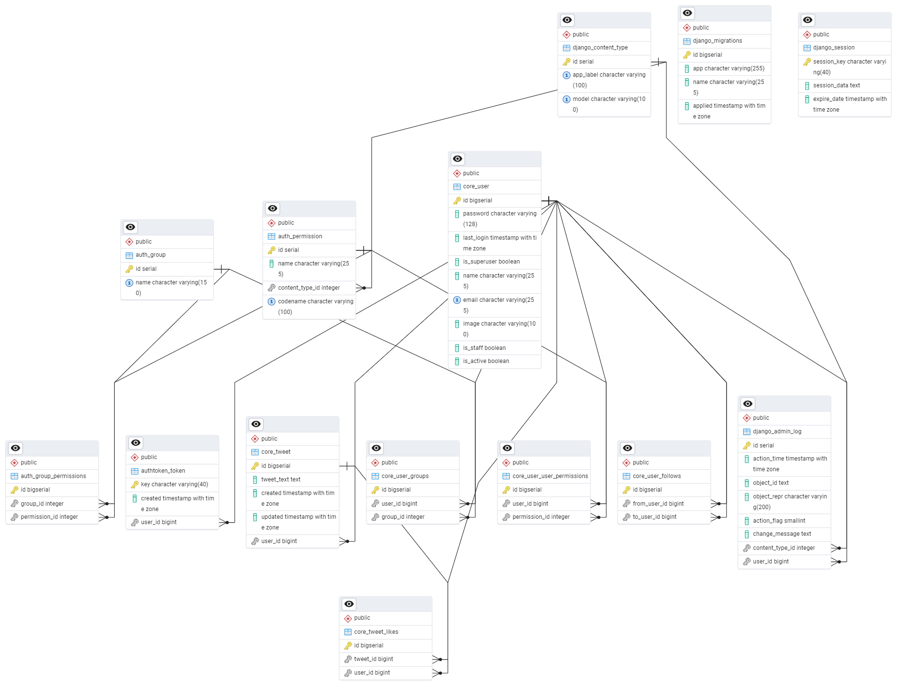

# MINI Twitter API 



> EDR Diagram

### TECHNICAL REQUIREMENTS

Tasks completed for the trainee position:

- [x] [TC.1] API Development
- [x] [TC.2] Authentication
- [x] [TC.3] Database
- [x] [TC.4.] Pagination
- [x] [TC.6] Documentation

## 💻 Requirements

Before you begin, make sure you have met the following requirements:

- Python 3.8 +
- PostgreSQL

## 🚀 Instalation - MINI Twitter API

1. **Clone the repository**

    ```bash
    git clone https://github.com/luanviniciuzz/api-twitter.git
    ```

2. **Create a virtual environment**

    ```bash
    python -m venv venv
    ```

3. **Activate the virtual environment**

    On Windows:
    ```bash
    .\venv\Scripts\Activate.ps1
    ```

    On macOS/Linux:
    ```bash
    source venv/bin/activate
    ```

4. **Install dependencies**

    ```bash
    pip install -r requirements.txt
    ```

    Make sure that `requirements.txt` includes the necessary libraries, such as `Django`, `djangorestframework`, and `psycopg2`.

5. **Configure the Database**

    In the `settings.py` file, locate the database configuration and replace it with your database details:

    ```python
    DATABASES = {
        'default': {
            'ENGINE': 'django.db.backends.postgresql',
            'NAME': 'database_name',
            'USER': 'username',
            'PASSWORD': 'your_password',
            'HOST': 'localhost',
            'PORT': '5432',
        }
    }
    ```

6. **Run migrations**

    ```bash
    python manage.py migrate
    ```

7. **Create a superuser (optional)**

    ```bash
    python manage.py createsuperuser
    ```

    Follow the instructions to create an admin user.

8. **Start the server**

    ```bash
    python manage.py runserver
    ```

    Your API will be available with the SWAGGER documentation at `http://127.0.0.1:8000/api/docs/#/`.
    Or Admin User `http://127.0.0.1:8000/admin`

```
## ☕ USE CASES MINI TWITTER API

### CASE 1: User Registration
- Users should be able to sign up via the API by providing an email, username, and password.
- Use JWT to handle authentication for login and session management.

### CASE 2: Post Creation
- Authenticated users can create a post with text and one image as content.
- Posts can be liked by other users.

### CASE 3: Follow/Unfollow User
- Users should be able to follow or unfollow others.
- The feed should only show posts from users the authenticated user follows.

### CASE 4: Viewing Feed
- The user can view a paginated list of posts from the users they follow.
- Posts should be ordered by creation time, from most recent to oldest.

